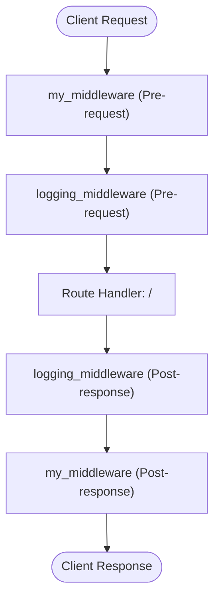

# FastAPI Middleware: A Practical Guide

A clean, beginner-to-intermediate guide explaining how middleware works in FastAPI, how to intercept requests and responses, and how to track execution time and inject custom headers.

---

## 📌 Table of Contents
1. [What is Middleware?](#what-is-middleware)
2. [How Middleware Works (The Onion Model)](#how-middleware-works-the-onion-model)
3. [Code Breakdown (`main.py`)](#code-breakdown-mainpy)
   - [1. Performance Logging Middleware](#1-performance-logging-middleware)
   - [2. Header Injection & Lifecycle Middleware](#2-header-injection--lifecycle-middleware)
   - [3. Order of Execution](#3-order-of-execution)
4. [Getting Started](#getting-started)
   - [Requirements](#requirements)
   - [Installation](#installation)
   - [Running the Server](#running-the-server)
5. [Testing the Middleware](#testing-the-middleware)
   - [Adding a Sample Route](#adding-a-sample-route)
   - [Inspecting with cURL](#inspecting-with-curl)
   - [Expected Console Output](#expected-console-output)
6. [Best Practices & Production Tips](#best-practices--production-tips)

---

## What is Middleware?

A **middleware** is a function that sits between incoming client requests and your route endpoints (as well as between your endpoints and outgoing responses):

- **Before Request Processing:** It can inspect or alter the incoming request (e.g., check authentication tokens, log headers, reject unwanted requests).
- **Endpoint Execution:** It passes control to the actual route handler via `call_next(request)`.
- **After Request Processing:** It can inspect or modify the generated response before it leaves the server (e.g., add security headers, compress payloads, calculate total processing time).

---

## How Middleware Works (The Onion Model)

FastAPI (built on Starlette) wraps middleware like layers of an onion:



> **Key Rule:** Middlewares execute in **reverse registration order** on the way in, and normal order on the way out. The last registered middleware (`@app.middleware("http")`) runs **first** when a request arrives.

---

## Code Breakdown (`main.py`)

### 1. Performance Logging Middleware

```python
@app.middleware("http")
async def logging_middleware(request: Request, call_next):
    start_time = time.time()
    response = await call_next(request)
    process_time = time.time() - start_time
    print(f"Request took {process_time} seconds to process")
    return response
```

- **`start_time = time.time()`**: Captures the exact moment before passing the request downstream.
- **`await call_next(request)`**: Hands over control to the next middleware or the endpoint handler.
- **`process_time = time.time() - start_time`**: Calculates the total round-trip time spent processing the request.

---

### 2. Header Injection & Lifecycle Middleware

```python
@app.middleware("http")
async def my_middleware(request: Request, call_next):
    print("My middleware is called! request received")
    response = await call_next(request)
    print("My middleware is done! response sent")
    response.headers["X-Custom-Header"] = "My custom header"
    return response
```

- Demonstrates logging before the request reaches the endpoint.
- Demonstrates modifying response headers (`response.headers[...] = ...`) after the endpoint returns.

---

### 3. Order of Execution

Because `my_middleware` was defined **after** `logging_middleware`, Starlette wraps `logging_middleware` inside `my_middleware`:

1. Request enters `my_middleware` &rarr; prints `"My middleware is called! request received"`.
2. `my_middleware` calls `await call_next(request)`.
3. Request enters `logging_middleware` &rarr; records `start_time`.
4. `logging_middleware` calls `await call_next(request)`.
5. The route handler processes the request and returns a response.
6. `logging_middleware` finishes &rarr; calculates and prints elapsed time.
7. `my_middleware` finishes &rarr; prints `"My middleware is done! response sent"` and appends `X-Custom-Header`.
8. The final response is delivered to the client.

---

## Getting Started

### Requirements
- Python 3.8+
- Virtual environment (recommended)

### Installation

1. Create and activate a virtual environment:

   **Linux / macOS:**
   ```bash
   python3 -m venv .venv
   source .venv/bin/activate
   ```

   **Windows (PowerShell):**
   ```powershell
   python -m venv .venv
   .\.venv\Scripts\Activate.ps1
   ```

2. Install dependencies:
   ```bash
   pip install fastapi uvicorn
   ```

### Running the Server

Start the Uvicorn development server:

```bash
uvicorn main:app --reload
```

The application will be accessible at:
- **API Base:** `http://127.0.0.1:8000`
- **Interactive Swagger Docs:** `http://127.0.0.1:8000/docs`

---

## Testing the Middleware

### Adding a Sample Route

To see the middleware in action, ensure you have an active route in `main.py`:

```python
@app.get("/")
async def root():
    return {"message": "Hello from FastAPI with custom middleware!"}
```

### Inspecting with cURL

Send a request and inspect the response headers (`-i` flag):

```bash
curl -i http://127.0.0.1:8000/
```

### Expected Response

```http
HTTP/1.1 200 OK
date: Fri, 18 Sep 2026 00:00:00 GMT
server: uvicorn
content-length: 59
content-type: application/json
x-custom-header: My custom header

{"message":"Hello from FastAPI with custom middleware!"}
```

### Expected Console Output

In your terminal running Uvicorn, you will observe the execution sequence:

```text
My middleware is called! request received
Request took 0.001234 seconds to process
My middleware is done! response sent
INFO:     127.0.0.1:54321 - "GET / HTTP/1.1" 200 OK
```

---

## Best Practices & Production Tips

| Tip | Details |
| :--- | :--- |
| **Expose Performance in Headers** | Instead of merely printing process time, send it back in a header: `response.headers["X-Process-Time"] = str(process_time)`. |
| **Avoid Heavy Blocking Operations** | Never run synchronous long-running I/O or heavy computation inside `async` middleware without `run_in_threadpool` or background tasks. |
| **Use Built-in Middlewares** | For CORS, GZip compression, or HTTPS redirects, prefer FastAPI / Starlette built-ins (`CORSMiddleware`, `GZipMiddleware`, `HTTPSRedirectMiddleware`). |
| **Error Handling in Middleware** | Remember that uncaught exceptions raised inside `call_next` will bubble up. Handle or log critical errors gracefully. |
| **Middleware vs Dependencies** | Use **middleware** for global cross-cutting concerns (logging, tracing, security headers). Use **FastAPI Dependencies** (`Depends`) for route-specific tasks (authentication, database sessions). |

---

## Summary

- `@app.middleware("http")` allows you to hook into the full HTTP lifecycle.
- It enables request inspection, timing calculation, and response header injection.
- Execution happens in reverse definition order on request, and normal definition order on response.
