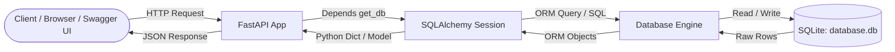

# 🚀 FastAPI + SQLAlchemy CRUD Mastery

A clean, beginner-friendly, and production-ready guide to building a RESTful CRUD API with **FastAPI**, **SQLAlchemy ORM**, and **SQLite**.

---

## 📌 Table of Contents

- [🚀 FastAPI + SQLAlchemy CRUD Mastery](#-fastapi--sqlalchemy-crud-mastery)
  - [📌 Table of Contents](#-table-of-contents)
  - [📖 Project Overview](#-project-overview)
    - [What it does:](#what-it-does)
  - [🏛 High-Level Architecture](#-high-level-architecture)
  - [🧠 Deep-Dive: Core Concepts Explained](#-deep-dive-core-concepts-explained)
    - [1. What is an ORM (Object-Relational Mapping)?](#1-what-is-an-orm-object-relational-mapping)
    - [2. The Database Engine (`create_engine`)](#2-the-database-engine-create_engine)
    - [3. The Session Factory (`sessionmaker` \& `SessionLocal`)](#3-the-session-factory-sessionmaker--sessionlocal)
    - [4. Declarative Base \& ORM Models](#4-declarative-base--orm-models)
    - [5. Primary Keys, Auto-Increment \& Indexes](#5-primary-keys-auto-increment--indexes)
      - [🔑 Primary Key (`primary_key=True`)](#-primary-key-primary_keytrue)
      - [⚡ Indexes (`index=True`)](#-indexes-indextrue)
    - [6. Dependency Injection \& Database Sessions (`get_db`)](#6-dependency-injection--database-sessions-get_db)
    - [7. Pydantic Schemas vs. SQLAlchemy Models](#7-pydantic-schemas-vs-sqlalchemy-models)
    - [8. The Core SQLAlchemy Lifecycle: `add`, `commit`, `refresh`, `delete`](#8-the-core-sqlalchemy-lifecycle-add-commit-refresh-delete)
    - [9. Professional Error Handling (`HTTPException`)](#9-professional-error-handling-httpexception)
    - [10. HTTP Methods: PUT vs. PATCH](#10-http-methods-put-vs-patch)
  - [🔍 Line-by-Line Code Walkthrough (`main.py`)](#-line-by-line-code-walkthrough-mainpy)
    - [1. Imports \& App Initialization](#1-imports--app-initialization)
    - [2. Database Connection \& Tables Setup](#2-database-connection--tables-setup)
    - [3. Session Dependency](#3-session-dependency)
    - [4. Health Check Endpoint](#4-health-check-endpoint)
    - [5. Create Todo (POST)](#5-create-todo-post)
    - [6. Read All Todos (GET)](#6-read-all-todos-get)
    - [7. Read Single Todo (GET with Path Parameter)](#7-read-single-todo-get-with-path-parameter)
    - [8. Update Todo (PUT)](#8-update-todo-put)
    - [9. Delete Todo (DELETE)](#9-delete-todo-delete)
  - [📡 API Endpoint Reference](#-api-endpoint-reference)
  - [💻 Getting Started \& Running Locally](#-getting-started--running-locally)
    - [1. Prerequisites](#1-prerequisites)
    - [2. Activate Your Virtual Environment](#2-activate-your-virtual-environment)
    - [3. Install Dependencies](#3-install-dependencies)
    - [4. Run the Development Server](#4-run-the-development-server)
    - [5. Interactive API Documentation](#5-interactive-api-documentation)
  - [🏆 Pro Developer Tips \& Production Best Practices](#-pro-developer-tips--production-best-practices)
    - [1. Modular Directory Structure](#1-modular-directory-structure)
    - [2. Use Pydantic Request Bodies Instead of Query Strings](#2-use-pydantic-request-bodies-instead-of-query-strings)
    - [3. Use Pydantic Response Models (`response_model`)](#3-use-pydantic-response-models-response_model)
    - [4. Database Migrations with Alembic](#4-database-migrations-with-alembic)
    - [🎉 Summary](#-summary)

---

## 📖 Project Overview

This project is a complete **Todo Management REST API**. It demonstrates how a modern Python backend interacts with a relational database using an Object-Relational Mapper (ORM) rather than writing raw, error-prone SQL queries.

### What it does:
- 🟢 **Create (POST)**: Add a new Todo item to the database.
- 🔵 **Read All (GET)**: Retrieve all Todo items from the database.
- 🔵 **Read One (GET)**: Retrieve a single Todo item by its unique ID.
- 🟡 **Update (PUT)**: Modify an existing Todo item.
- 🔴 **Delete (DELETE)**: Remove a Todo item permanently.

---

## 🏛 High-Level Architecture

Here is how data flows from the client to the database and back:



---

## 🧠 Deep-Dive: Core Concepts Explained

### 1. What is an ORM (Object-Relational Mapping)?
In traditional database programming, you write raw SQL strings:
```python
cursor.execute("SELECT * FROM todos WHERE id = 1")
row = cursor.fetchone()
```
An **ORM** like SQLAlchemy bridges the gap between Python classes and database tables. You interact with Python objects instead:
```python
todo = db.query(Todo).filter(Todo.id == 1).first()
print(todo.title)
```
- **Benefit**: Type safety, auto-completion, vendor independence (works across SQLite, PostgreSQL, MySQL), and protection against SQL injection attacks.

---

### 2. The Database Engine (`create_engine`)
```python
engine = create_engine(
    'sqlite:///database.db', 
    echo=True, 
    connect_args={"check_same_thread": False}
)
```
- `'sqlite:///database.db'`: The database URL. The three slashes `///` indicate a relative path to the local file `database.db`.
- `echo=True`: Tells SQLAlchemy to log all generated SQL queries directly to your terminal. It is invaluable for learning and debugging!
- `connect_args={"check_same_thread": False}`:
  - **Why is this needed?** By default, SQLite only allows the specific thread that opened a connection to communicate with it.
  - FastAPI handles requests concurrently across multiple worker threads.
  - Setting `check_same_thread=False` allows FastAPI's asynchronous/multithreaded workers to safely share connection handling for SQLite. (Note: Only SQLite requires this setting; Postgres or MySQL do not need it).

---

### 3. The Session Factory (`sessionmaker` & `SessionLocal`)
```python
SessionLocal = sessionmaker(bind=engine)
```
- `engine` represents the actual **connection pool and dialect** to the physical database.
- `SessionLocal` is a **factory class** that generates fresh database sessions.
- Think of `SessionLocal()` as opening a "workspace" or transaction with the database where you can query, stage, and commit changes.

---

### 4. Declarative Base & ORM Models
```python
Base = declarative_base()

class Todo(Base):
    __tablename__ = 'todos'
    id = Column(Integer, primary_key=True, index=True)
    title = Column(String)
    description = Column(String)
    completed = Column(Integer)
```
- `Base`: A base class provided by SQLAlchemy. All models inherit from it so SQLAlchemy can track table definitions.
- `__tablename__ = 'todos'`: Explicit name of the SQL table in SQLite.
- `Base.metadata.create_all(bind=engine)`: Inspects all classes inheriting from `Base` and creates corresponding tables in the database if they do not exist yet.

---

### 5. Primary Keys, Auto-Increment & Indexes

#### 🔑 Primary Key (`primary_key=True`)
Every database record needs a unique identifier so you can pinpoint, update, or delete it without ambiguity.
- **Auto-Increment**: You don't have to specify an `id` when creating a new record. The database generates the next integer automatically (`1, 2, 3, ...`).
  - **SQLite**: An `INTEGER PRIMARY KEY` column automatically acts as an alias for the internal 64-bit signed `rowid`.
  - **PostgreSQL**: Handled using `SERIAL` or `GENERATED ALWAYS AS IDENTITY`.
  - **MySQL**: Handled using `AUTO_INCREMENT`.

#### ⚡ Indexes (`index=True`)
```python
id = Column(Integer, primary_key=True, index=True)
```
- Without an index, finding a record requires a **Full Table Scan** (checking row 1, row 2, row 3... until row 1,000,000).
- An index creates a lookup data structure (usually a B-Tree), like an index at the back of a book. It turns an $O(N)$ lookup into an instant $O(\log N)$ search.

---

### 6. Dependency Injection & Database Sessions (`get_db`)
```python
def get_db():
    db = SessionLocal()
    try:
        yield db
    finally:
        db.close()
```
FastAPI uses **Dependency Injection** via `Depends(get_db)`.
- When an endpoint is called, FastAPI executes `get_db()`.
- It creates a dedicated database session `db = SessionLocal()`.
- The `yield db` pauses `get_db()` and passes `db` into your route function.
- Once the endpoint finishes (or even if an error crashes the request), execution resumes in the `finally:` block.
- `db.close()` guarantees that the connection is cleanly closed and returned to the pool, preventing **connection leaks** or memory exhaustion.

---

### 7. Pydantic Schemas vs. SQLAlchemy Models
A common point of confusion for beginners is having two classes representing the same data:
```python
# 1. SQLAlchemy ORM Model (Database Layer)
class Todo(Base):
    __tablename__ = 'todos'
    id = Column(Integer, primary_key=True)
    title = Column(String)

# 2. Pydantic Schema (Validation / API Layer)
class TodoUpdate(BaseModel):
    title: str
    description: str
    completed: int
```

| Feature | SQLAlchemy Model | Pydantic Schema |
| :--- | :--- | :--- |
| **Purpose** | Defines the database table schema | Validates and parses incoming HTTP payloads |
| **Location** | Database / Storage layer | API / Request-Response layer |
| **Inherits From** | `declarative_base()` | `pydantic.BaseModel` |
| **Key Capability** | Performs queries, commits, relations | Data validation, type coercion, Swagger UI docs |

---

### 8. The Core SQLAlchemy Lifecycle: `add`, `commit`, `refresh`, `delete`

When modifying data in SQLAlchemy, operations follow a structured sequence:

```
[ New Object ] 
      │
      ▼ (db.add)
[ Staged in Session ] 
      │
      ▼ (db.commit)
[ Written to Database ] 
      │
      ▼ (db.refresh)
[ Updated with DB Defaults (like ID) ]
```

1. **`db.add(todo)`**: Stages the object inside the current session's pending list. (No SQL is executed on the database yet).
2. **`db.commit()`**: Flushes and commits the transaction to the database permanently.
3. **`db.refresh(todo)`**: Re-queries the database for this specific object to pull in any server-generated values (such as the auto-generated `id` or default timestamps).
4. **`db.delete(todo)`**: Marks an existing entity to be deleted upon the next `commit()`.

---

### 9. Professional Error Handling (`HTTPException`)
When a user requests an ID that doesn't exist, how should an API respond?

❌ **Amateur Approach:**
```python
if not todo:
    return {"Message": "Todo not found"}  # Still returns HTTP Status 200 OK!
```
> *Problem*: The client receives HTTP 200 (Success) even though the resource was not found. Automated HTTP clients and frontends won't know an error occurred.

✅ **Pro Developer Approach:**
```python
if not todo:
    raise HTTPException(status_code=404, detail="Todo not found")
```
> *Why*: Returns true standard HTTP status code `404 Not Found` along with a standardized JSON error response.

---

### 10. HTTP Methods: PUT vs. PATCH
- **`PUT`**: Used to replace the entire resource. If you only provide `title`, missing fields like `description` or `completed` may be reset to default or null.
- **`PATCH`**: Used for partial updates (e.g., updating just the `completed` flag without resending the title and description).

---

## 🔍 Line-by-Line Code Walkthrough (`main.py`)

Here is how each section of [main.py](file:///C:/Users/rahim_ullah/Downloads/FastAPI/15-sqlalchemy-crud/main.py) fits together:

### 1. Imports & App Initialization
```python
from sqlalchemy import create_engine, Column, Integer, String
from sqlalchemy.orm import declarative_base, Session as DBSession, sessionmaker
from fastapi import FastAPI, Depends, HTTPException
from pydantic import BaseModel

app = FastAPI()
```
Imports essential database drivers, ORM constructs, FastAPI decorators, and Pydantic validation tools.

---

### 2. Database Connection & Tables Setup
```python
engine = create_engine('sqlite:///database.db', echo=True, connect_args={"check_same_thread": False})
SessionLocal = sessionmaker(bind=engine)
Base = declarative_base()

class Todo(Base):
    __tablename__ = 'todos'
    id = Column(Integer, primary_key=True, index=True)
    title = Column(String)
    description = Column(String)
    completed = Column(Integer)

Base.metadata.create_all(bind=engine)
```
Configures the SQLite engine, session factory, the `todos` model, and creates the table schema immediately.

---

### 3. Session Dependency
```python
def get_db():
    db = SessionLocal()
    try:
        yield db
    finally:
        db.close()
```
Provides safe session lifecycle management per request.

---

### 4. Health Check Endpoint
```python
@app.get("/")
def read_root():
    return {"Connection": "Database connected successfully!"}
```
A quick sanity-check endpoint to verify that the API is up and running.

---

### 5. Create Todo (POST)
```python
@app.post("/todos")
def create_todo(title: str, db: DBSession = Depends(get_db)):
    todo = Todo(title=title, description="This is a sample todo", completed=0)
    db.add(todo)
    db.commit()
    db.refresh(todo)
    return {"Message": f"Todo {todo.title} created successfully!"}
```
Accepts a `title` query parameter, instantiates a `Todo` model, saves it to SQLite, and returns a confirmation message.

---

### 6. Read All Todos (GET)
```python
@app.get("/todos")
def read_todos(db: DBSession = Depends(get_db)):
    todos = db.query(Todo).all()
    return {"Total": f"Total {len(todos)} todos found!", " Todos": todos}
```
Executes `SELECT * FROM todos` and serializes the list into a JSON response.

---

### 7. Read Single Todo (GET with Path Parameter)
```python
@app.get("/todos/{id}")
def read_todo(id: int, db: DBSession = Depends(get_db)):
    todo = db.query(Todo).filter(Todo.id == id).first()
    if not todo:
        raise HTTPException(status_code=404, detail="Todo not found")
    return {"Todo": todo}
```
Queries by `id`. If the record is absent, returns an HTTP 404 error; otherwise, returns the Todo object.

---

### 8. Update Todo (PUT)
```python
@app.put("/todos/{id}")
def update_todo(id: int, title: str, db: DBSession = Depends(get_db)):
    todo : Todo | None = db.query(Todo).filter(Todo.id == id).first()
    if not todo:
        raise HTTPException(status_code=404, detail="Todo not found")
        
    todo.title = title
    db.commit()
    db.refresh(todo)
    return {"Message": f"Todo {todo.title} updated successfully!"}
```
Locates the existing item by ID, updates its `title`, and commits the changes.

---

### 9. Delete Todo (DELETE)
```python
@app.delete("/todos/{id}")
def delete_todo(id: int, db: DBSession = Depends(get_db)):
    todo = db.query(Todo).filter(Todo.id == id).first()
    if not todo:
        return {"Message": f"Todo with id {id} not found! make sure to enter the correct id..."}
    title = todo.title
    db.delete(todo)
    db.commit()
    return {"Message": f"Todo {title} deleted successfully!"}
```
Finds the item, stages its deletion using `db.delete(todo)`, and finalizes it with `db.commit()`.

---

## 📡 API Endpoint Reference

| Method | Endpoint | Parameters | Description | Status Code |
| :--- | :--- | :--- | :--- | :--- |
| `GET` | `/` | None | Health check & connection confirmation | `200 OK` |
| `POST` | `/todos` | `title` (query string) | Creates a new Todo record | `200 OK` |
| `GET` | `/todos` | None | Fetches all Todo records | `200 OK` |
| `GET` | `/todos/{id}` | `id` (path parameter) | Fetches a single Todo by its primary key ID | `200 OK` / `404 Not Found` |
| `PUT` | `/todos/{id}` | `id` (path), `title` (query) | Updates title of an existing Todo | `200 OK` / `404 Not Found` |
| `DELETE` | `/todos/{id}` | `id` (path parameter) | Deletes a Todo record from the database | `200 OK` |

---

## 💻 Getting Started & Running Locally

### 1. Prerequisites
Make sure you have **Python 3.10+** installed on your system.

### 2. Activate Your Virtual Environment
If you are using the existing `.venv` in this project:

**Windows (PowerShell):**
```powershell
.venv\Scripts\Activate.ps1
```

**Windows (Command Prompt):**
```cmd
.venv\Scripts\activate.bat
```

**Linux / macOS:**
```bash
source .venv/bin/activate
```

### 3. Install Dependencies
```bash
pip install fastapi uvicorn sqlalchemy
```

### 4. Run the Development Server
```bash
uvicorn main:app --reload
```
- `--reload`: Enables hot-reloading so server re-runs automatically whenever you save `main.py`.

### 5. Interactive API Documentation
FastAPI provides automatic interactive Swagger UI documentation out of the box:
- **Swagger UI**: [http://127.0.0.1:8000/docs](http://127.0.0.1:8000/docs)
- **ReDoc**: [http://127.0.0.1:8000/redoc](http://127.0.0.1:8000/redoc)

---

## 🏆 Pro Developer Tips & Production Best Practices

When transitioning from a single tutorial script to a scalable production application, adopt these real-world best practices:

### 1. Modular Directory Structure
Instead of putting everything in `main.py`, organize your project using the **Separation of Concerns** pattern:
```text
my_project/
├── app/
│   ├── __init__.py
│   ├── main.py          # App initialization & route inclusion
│   ├── database.py      # Engine, SessionLocal, Base, get_db
│   ├── models.py        # SQLAlchemy ORM models (Todo, User)
│   ├── schemas.py       # Pydantic schemas (TodoCreate, TodoResponse)
│   ├── crud.py          # Database queries & business logic
│   └── routers/
│       ├── __init__.py
│       └── todos.py     # Endpoints for todos
├── database.db
└── requirements.txt
```

### 2. Use Pydantic Request Bodies Instead of Query Strings
Instead of passing `title: str` as a URL query parameter for `POST` and `PUT`, receive a JSON request body:
```python
class TodoCreate(BaseModel):
    title: str
    description: str | None = None
    completed: bool = False

@app.post("/todos", status_code=201)
def create_todo(payload: TodoCreate, db: DBSession = Depends(get_db)):
    todo = Todo(**payload.model_dump())
    db.add(todo)
    db.commit()
    db.refresh(todo)
    return todo
```

### 3. Use Pydantic Response Models (`response_model`)
Never return raw database entities directly without schema filtering. Using `response_model` ensures that sensitive fields (like hashed passwords) are never accidentally exposed:
```python
class TodoResponse(BaseModel):
    id: int
    title: str
    description: str
    completed: int

    class Config:
        from_attributes = True  # Allows Pydantic to read SQLAlchemy ORM objects

@app.get("/todos/{id}", response_model=TodoResponse)
def read_todo(id: int, db: DBSession = Depends(get_db)):
    ...
```

### 4. Database Migrations with Alembic
`Base.metadata.create_all(bind=engine)` creates tables if they don't exist, but it **will not update tables** if you add or remove columns later. In production, always use **Alembic** to manage database schema migrations version by version.

---

### 🎉 Summary
You now understand how FastAPI and SQLAlchemy work together:
- **FastAPI** handles incoming web requests, routing, and serialization.
- **SQLAlchemy Engine & Session** manage the connection and SQL transactions.
- **ORM Models** define the database schema in Pythonic classes.
- **Dependency Injection (`Depends`)** ensures clean, leak-free database connection lifecycles.
