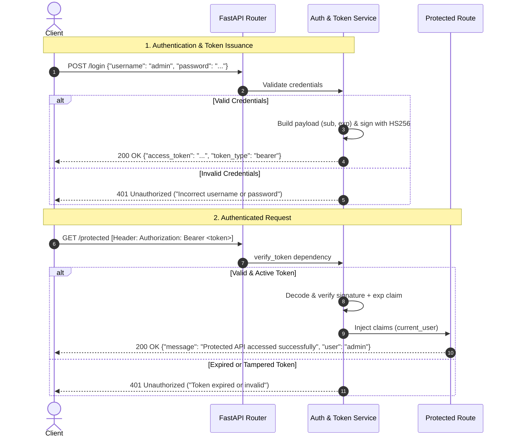

# FastAPI JWT Bearer Authentication

A clean, modular reference implementation of stateless JSON Web Token (JWT) Bearer authentication built with **FastAPI**, **python-jose**, and **Pydantic v2**.

This project demonstrates how to structure idiomatic authentication using FastAPI's dependency injection system (`Depends`), HTTP Bearer security schemes, and standard RFC 7519 JWT claims (`sub`, `exp`).

---

## ⚡ Highlights

- **Native Swagger UI Integration**: Uses `HTTPBearer` to natively unlock the interactive **Authorize 🔒** button in `/docs`.
- **JSON-First Auth**: Authenticates via clean JSON payloads (`application/json`) rather than form-data, making it ideal for SPAs (React, Vue, Next.js) and mobile clients.
- **Timezone-Aware Claims**: Token generation uses `datetime.now(timezone.utc)` to prevent local offset desync issues.
- **Strict Error Handling**: Returns RFC-compliant `401 Unauthorized` responses with appropriate `WWW-Authenticate: Bearer` headers on expired, malformed, or missing token claims.
- **Idiomatic Dependency Injection**: Route handlers receive decoded user payload directly via `Depends(verify_token)`.

---

## 🔄 Authentication Workflow



---

## 📁 Project Structure

```text
.
├── main.py              # Application entrypoint, auth logic, schemas, and routes
├── requirements.txt     # Locked production dependencies
└── README.md            # Documentation
```

---

## 🚀 Quick Start

### 1. Prerequisites
- Python `3.10+` (tested up to Python `3.14`)
- Virtual environment manager (`venv`)

### 2. Clone & Setup Environment

```bash
# Clone the repository
git clone <your-repo-url>
cd 17-auth

# Create a virtual environment
python -m venv .venv

# Activate environment
# On Windows (PowerShell):
.venv\Scripts\Activate.ps1
# On macOS / Linux:
source .venv/bin/activate
```

### 3. Install Dependencies

```bash
pip install fastapi uvicorn[standard] python-jose[cryptography] pydantic
```

*(Alternatively, if you create a `requirements.txt`: `pip install -r requirements.txt`)*

### 4. Run the Application

You can launch the development server directly:

```bash
python main.py
```

Or run via Uvicorn CLI with hot-reload enabled:

```bash
uvicorn main:app --host 127.0.0.1 --port 8000 --reload
```

The server will spin up at:
- **API Root**: [http://127.0.0.1:8000](http://127.0.0.1:8000)
- **Interactive Swagger Docs**: [http://127.0.0.1:8000/docs](http://127.0.0.1:8000/docs)
- **ReDoc Alternative**: [http://127.0.0.1:8000/redoc](http://127.0.0.1:8000/redoc)

---

## 🧪 Testing the Endpoints

### Default Demo Credentials
- **Username**: `admin`
- **Password**: `admin`

---

### 1. Authenticate & Obtain Token

**Request:**
```bash
curl -X POST "http://127.0.0.1:8000/login" \
     -H "Content-Type: application/json" \
     -d "{\"username\": \"admin\", \"password\": \"admin\"}"
```

**Response (`200 OK`):**
```json
{
  "access_token": "eyJhbGciOiJIUzI1NiIsInR5cCI6IkpXVCJ9...",
  "token_type": "bearer"
}
```

---

### 2. Access Protected Route

Export the token or substitute it into the `Authorization` header:

```bash
# Set token variable (Linux/macOS / Git Bash)
export TOKEN="your_access_token_here"

# Windows PowerShell:
# $TOKEN = "your_access_token_here"

curl -X GET "http://127.0.0.1:8000/protected" \
     -H "Authorization: Bearer $TOKEN"
```

**Response (`200 OK`):**
```json
{
  "message": "Protected API accessed successfully",
  "user": "admin"
}
```

---

### 3. Unauthorized / Expired Attempt

Requesting `/protected` without a token or with an invalid token returns:

```bash
curl -X GET "http://127.0.0.1:8000/protected"
```

**Response (`401 Unauthorized`):**
```json
{
  "detail": "Not authenticated"
}
```

---

## 🖥️ Testing in Swagger UI (`/docs`)

1. Open `http://127.0.0.1:8000/docs`.
2. Expand `POST /login`, click **Try it out**, enter `admin` for both fields, and execute.
3. Copy the returned `access_token` string from the response body.
4. Scroll to the top and click the green **Authorize 🔒** button.
5. Paste the token into the `Value` field (do not prepend `Bearer`, Swagger does it automatically).
6. Click **Authorize**, then **Close**.
7. Expand `GET /protected`, click **Try it out**, and execute. You should receive a `200 OK` with your username.

---

## 🛠️ Design & Implementation Details

### Why `HTTPBearer` over `OAuth2PasswordBearer`?
- **`OAuth2PasswordBearer`** mandates OAuth2 password flow specifications, expecting form-encoded data (`application/x-www-form-urlencoded`) with strict field names (`username` and `password`).
- **`HTTPBearer`** allows you to accept standard JSON bodies (`LoginRequest`) while still declaring the standard `Authorization: Bearer <token>` security scheme in OpenAPI/Swagger documentation.

### Standard Claims Used
- **`sub` (Subject)**: Stores the user identity (in this case, username). Used by route dependencies to identify the caller.
- **`exp` (Expiration Time)**: Unix epoch timestamp representing token expiration. The `jose.jwt.decode` function automatically enforces expiration during decoding.

---

## 🛡️ Production Hardening Checklist

When transitioning this demo pattern to a production system, implement the following:

- [ ] **Secure Secret Management**: Move `SECRET_KEY` and `ALGORITHM` out of code into environment variables using `pydantic-settings` or `.env`.
- [ ] **Password Hashing**: Never compare plain-text strings. Hash passwords using `bcrypt` or `argon2` (e.g., `passlib[bcrypt]` or `pwdlib`).
- [ ] **Database Integration**: Replace hardcoded credential checks with database lookups via an ORM (SQLAlchemy, SQLModel, Tortoise).
- [ ] **Token Expiration & Refresh**:
  - Keep access tokens short-lived (e.g., 5–15 minutes).
  - Implement a sliding refresh token rotation pattern stored securely (e.g., `HttpOnly`, `SameSite=Strict` cookies or server-side session stores).
- [ ] **Asymmetric Signing (Optional)**: For microservices architectures, switch from symmetric `HS256` to asymmetric `RS256` or `ES256` so internal services can verify tokens with a public key without sharing the signing secret.
- [ ] **CORS Middleware**: Explicitly configure allowed origins with `fastapi.middleware.cors.CORSMiddleware`.

---

## 📄 License

Distributed under the [MIT License](LICENSE). Feel free to use and adapt this pattern in your own projects.
