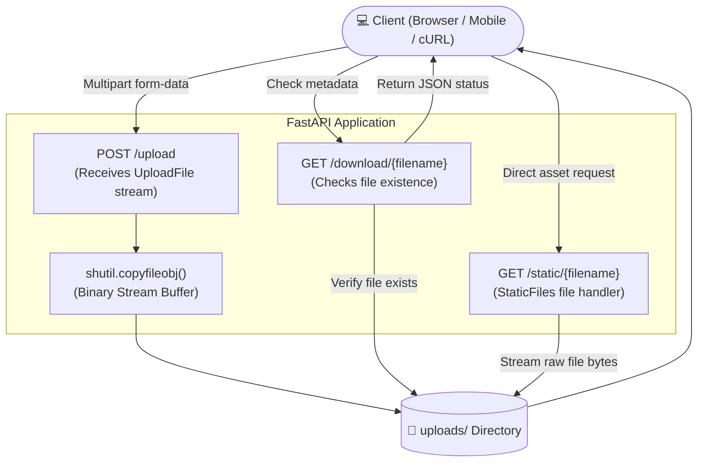

# 📁 FastAPI File Server

A lightweight, robust, and beginner-friendly file storage and serving backend built with **FastAPI**, **Uvicorn**, and Python's native file handling utilities.

Whether you're building a profile picture uploader, a local document drive, or learning how multipart form-data streams across the web, this project demonstrates clean, asynchronous file ingestion and static file hosting with zero unnecessary complexity.

---

## 🚀 Key Features

- **⚡ Chunk-Buffered Ingestion**: Uses `shutil.copyfileobj` to stream binary file data directly into disk storage, avoiding heavy memory consumption on larger files.
- **📂 Auto-Provisioned Storage**: Automatically ensures the `uploads/` target directory exists on application startup.
- **🌐 Static Asset Serving**: Mounts `/static` using Starlette's `StaticFiles`, allowing direct browser preview and streaming of images, PDFs, videos, and raw text files.
- **🔍 File Existence Validation**: Provides graceful HTTP error responses (`400 Bad Request`, `404 Not Found`) when files are missing or requests are invalid.
- **📖 Self-Documenting API**: Instant access to interactive OpenAPI docs (`/docs` via Swagger UI and `/redoc` via ReDoc).

---

## 🏗️ Architecture & Request Flow

Here is how data flows through the application:



---

## 📂 Project Structure

```text
19-file-server/
│
├── main.py              # Application entry point & route definitions
├── uploads/             # Destination directory for all uploaded files (auto-generated)
└── README.md            # Project documentation & usage guide
```

---

## 🛠️ Getting Started

### 1. Prerequisites

Ensure you have **Python 3.8+** installed on your system.

Verify your installation:
```bash
python --version
# or on Windows:
py --version
```

### 2. Set Up a Virtual Environment

It is recommended to isolate your project dependencies:

**On Windows (PowerShell):**
```powershell
python -m venv venv
.\venv\Scripts\Activate.ps1
```

**On Windows (Command Prompt):**
```cmd
python -m venv venv
venv\Scripts\activate.bat
```

**On macOS / Linux:**
```bash
python3 -m venv venv
source venv/bin/activate
```

### 3. Install Required Dependencies

FastAPI requires `uvicorn` (ASGI server) and `python-multipart` to parse incoming file uploads:

```bash
pip install fastapi "uvicorn[standard]" python-multipart
```

*(Optional)* If you wish to freeze dependencies into a `requirements.txt`:
```bash
pip freeze > requirements.txt
```

### 4. Run the Development Server

Launch the ASGI server with hot-reload enabled:

```bash
uvicorn main:app --reload
```

You should see output similar to:
```text
INFO:     Uvicorn running on http://127.0.0.1:8000 (Press CTRL+C to quit)
INFO:     Started reloader process
INFO:     Started server process
INFO:     Waiting for application startup.
INFO:     Application startup complete.
```

---

## 📡 API Endpoints Reference

### 1. Upload a File
Stream any binary file to the server and store it inside the `uploads/` directory.

- **Method**: `POST`
- **Path**: `/upload`
- **Content-Type**: `multipart/form-data`
- **Body Parameter**: `file` (Binary file object)

#### Example Request (`cURL`):
```bash
curl -X POST "http://127.0.0.1:8000/upload" \
  -H "accept: application/json" \
  -F "file=@sample.png"
```

#### Example Response (`200 OK`):
```json
{
  "Message": "File uploaded successfully",
  "filename": "sample.png",
  "path": "/http://127.0.0.1:8000/files/sample.png"
}
```

---

### 2. Check / Download File Metadata
Verifies whether a file exists in storage and returns its retrieval details.

- **Method**: `GET`
- **Path**: `/download/{filename}`
- **URL Parameter**: `filename` (string)

#### Example Request (`cURL`):
```bash
curl -X GET "http://127.0.0.1:8000/download/sample.png"
```

#### Example Response (`200 OK`):
```json
{
  "Message": "File downloaded successfully",
  "filename": "sample.png",
  "path": "/http://127.0.0.1:8000/files/sample.png"
}
```

#### File Not Found (`404 Not Found`):
```json
{
  "detail": "File not found"
}
```

---

### 3. Direct Static File Access (Direct Download / Preview)
Because the server mounts `/static` directly to the `uploads/` folder, you can directly access, preview, or download raw files in your browser or curl client:

- **URL Pattern**: `http://127.0.0.1:8000/static/{filename}`
- **Example**: Open `http://127.0.0.1:8000/static/sample.png` directly in your browser to view the image.

#### Downloading the raw binary file via cURL:
```bash
curl -O "http://127.0.0.1:8000/static/sample.png"
```

---

## 🧪 Interactive Testing with Swagger UI

FastAPI generates interactive documentation out of the box:

1. Open your browser and navigate to: **[http://127.0.0.1:8000/docs](http://127.0.0.1:8000/docs)**
2. Click on the `POST /upload` endpoint.
3. Click **"Try it out"**.
4. Choose any local file from your machine and click **"Execute"**.
5. Observe the response code and payload instantly!

Alternative documentation style: **[http://127.0.0.1:8000/redoc](http://127.0.0.1:8000/redoc)**

---

## 💻 Client Integration Examples

### Python (`requests`)
```python
import requests

url = "http://127.0.0.1:8000/upload"
file_path = "document.pdf"

with open(file_path, "rb") as f:
    files = {"file": (file_path, f, "application/pdf")}
    response = requests.post(url, files=files)

print("Status Code:", response.status_code)
print("Response JSON:", response.json())
```

### JavaScript (`fetch` / Browser)
```javascript
const uploadFile = async (fileInput) => {
  const formData = new FormData();
  formData.append("file", fileInput.files[0]);

  const response = await fetch("http://127.0.0.1:8000/upload", {
    method: "POST",
    body: formData,
  });

  const result = await response.json();
  console.log("Upload result:", result);
};
```

---

## 🔍 Code Walkthrough (`main.py`)

Here is an analysis of how the 4 pipeline steps in [`main.py`](main.py) work under the hood:

```python
# 1. Directory Initialization
UPLOAD_FOLDER = "uploads"
if not os.path.exists(UPLOAD_FOLDER):
    os.mkdir(UPLOAD_FOLDER)
```
> **What it does**: Checks at module load time whether the `uploads` directory is present. If missing, it creates it automatically so file operations never fail on a fresh machine.

```python
# 2. Static Files Mounting
app.mount("/static", StaticFiles(directory=UPLOAD_FOLDER), name="files")
```
> **What it does**: Binds Starlette's `StaticFiles` handler to the `/static` route prefix. Any file placed inside `uploads/` is immediately accessible to clients via HTTP `GET`.

```python
# 3. Memory-Safe Chunk Copying
with open(file_path, "wb") as f_buffer:
    shutil.copyfileobj(file.file, f_buffer)
```
> **What it does**: Instead of reading the entire file into server RAM using `file.file.read()`, `shutil.copyfileobj` streams the file in chunks from the temporary buffer into the target file on disk. This prevents memory spikes when handling larger files.

```python
# 4. Existence Check on Download
file_path = os.path.join(UPLOAD_FOLDER, filename)
if not os.path.exists(file_path):
    raise HTTPException(status_code=404, detail="File not found")
```
> **What it does**: Validates requested filenames against the local disk before returning confirmation, raising a clean standard HTTP 404 if the file is missing.

---

## 💡 Production Enhancements & Recommendations

If you plan to use this in a staging or production environment, consider these practical improvements:

1. **Path Traversal Security**:
   Always sanitize the filename using `os.path.basename(filename)` or Python's `pathlib.Path(filename).name` to prevent malicious directory traversal attacks (e.g., `../../etc/passwd` or `../../Windows/System32`).

2. **True File Download (`FileResponse`)**:
   Currently, `/download/{filename}` returns a JSON status object. To have the browser prompt a native download window with the actual file bytes, return a `FileResponse`:
   ```python
   from fastapi.responses import FileResponse

   @app.get("/download/{filename}")
   async def download_file(filename: str):
       file_path = os.path.join(UPLOAD_FOLDER, os.path.basename(filename))
       if not os.path.exists(file_path):
           raise HTTPException(status_code=404, detail="File not found")
       return FileResponse(path=file_path, filename=filename, media_type="application/octet-stream")
   ```

3. **Unique Filenames**:
   If two users upload `image.png`, the second will overwrite the first. Prepend a UUID or timestamp (e.g., `f"{uuid.uuid4().hex}_{filename}"`) to ensure uniqueness.

4. **File Size Restrictions**:
   Limit maximum upload size using middleware or custom stream inspection to safeguard against disk exhaustion.

---

## ❓ Troubleshooting & FAQ

<details>
<summary><b>1. Error: <code>Form data requires "python-multipart" to be installed</code></b></summary>
FastAPI requires the <code>python-multipart</code> package to parse form-data. Run:
<pre><code>pip install python-multipart</code></pre>
</details>

<details>
<summary><b>2. Why does <code>/download/{filename}</code> return JSON instead of a file download?</b></summary>
The current route handler returns a JSON response indicating whether the file exists. To download the actual file, either access it via <code>http://127.0.0.1:8000/static/{filename}</code> or use <code>FileResponse</code> as shown in the Production Enhancements section.
</details>

<details>
<summary><b>3. How do I change the upload folder path?</b></summary>
Update the <code>UPLOAD_FOLDER</code> variable in <code>main.py</code> (e.g., <code>UPLOAD_FOLDER = "data/storage"</code>) or read it from an environment variable via <code>os.getenv("UPLOAD_DIR", "uploads")</code>.
</details>

---

## 📜 License

This project is open-source and free to use for educational and personal projects. Happy coding! 🚀
