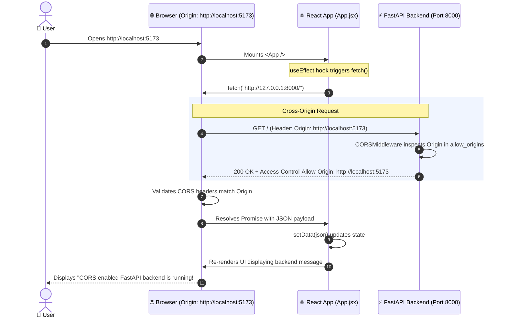

# 🌐 FastAPI & React: Cross-Origin Resource Sharing (CORS) Guide

A comprehensive, production-grade guide and reference implementation explaining **Cross-Origin Resource Sharing (CORS)** between a modern **FastAPI** backend and a **React 19 (Vite)** frontend.

---

## 📋 Table of Contents

- [Overview](#-overview)
- [Architecture & Request Flow](#-architecture--request-flow)
- [Project Structure](#-project-structure)
- [Core Concepts Explained](#-core-concepts-explained)
  - [1. What is CORS and the Same-Origin Policy (SOP)?](#1-what-is-cors-and-the-same-origin-policy-sop)
  - [2. Anatomy of an Origin](#2-anatomy-of-an-origin)
  - [3. Preflight Requests (`OPTIONS`) vs Simple Requests](#3-preflight-requests-options-vs-simple-requests)
  - [4. FastAPI `CORSMiddleware` Deep Dive](#4-fastapi-corsmiddleware-deep-dive)
- [The Two Classic Bugs Debunked](#-the-two-classic-bugs-debunked)
  - [Bug 1: The Trailing Slash Trap in Origins](#bug-1-the-trailing-slash-trap-in-origins)
  - [Bug 2: React `useState` vs `useEffect` for Data Fetching](#bug-2-react-usestate-vs-useeffect-for-data-fetching)
- [Getting Started](#-getting-started)
  - [Backend Setup (FastAPI)](#1-backend-setup-fastapi)
  - [Frontend Setup (React + Vite)](#2-frontend-setup-react--vite)
- [How to Inspect CORS in Browser DevTools](#-how-to-inspect-cors-in-browser-devtools)
- [Production Best Practices](#-production-best-practices)

---

## 🎯 Overview

When developing decoupled modern applications, your frontend client typically runs on a local development server (e.g., `http://localhost:5173`) while your API backend runs on a different port or host (e.g., `http://127.0.0.1:8000`).

By default, web browsers enforce the **Same-Origin Policy (SOP)** to protect users from malicious cross-site scripting. As a result, cross-origin HTTP requests initiated from scripts are blocked unless the server explicitly grants permission via HTTP response headers.

This project demonstrates:
- How to configure FastAPI's `CORSMiddleware` correctly.
- How to avoid the most common CORS configuration pitfalls.
- How to fetch data safely using React hooks (`useEffect`) and display the response.

---

## 🏗️ Architecture & Request Flow



---

## 📂 Project Structure

```text
20-cors/
│
├── back-end/
│   ├── .venv/                   # Python Virtual Environment
│   └── main.py                  # FastAPI application with CORSMiddleware
│
├── front-end/
│   └── cors-frontend/
│       ├── src/
│       │   ├── App.jsx          # React Component fetching backend API
│       │   ├── main.jsx         # React DOM root entry
│       │   └── index.css        # Stylesheet
│       ├── index.html           # HTML entry point
│       ├── vite.config.js       # Vite build configuration
│       └── package.json         # Node.js dependencies (React 19, Vite)
│
└── README.md                    # Project documentation
```

---

## 💡 Core Concepts Explained

### 1. What is CORS and the Same-Origin Policy (SOP)?

The **Same-Origin Policy** is a fundamental browser security mechanism that restricts how a document or script loaded by one origin can interact with a resource from another origin.

**CORS (Cross-Origin Resource Sharing)** is an HTTP-header-based mechanism that allows a server to relax the Same-Origin Policy and explicitly tell the browser:
> *"I permit scripts executing on origin `http://localhost:5173` to read my API responses."*

> [!IMPORTANT]
> CORS is enforced by the **browser**, not the server. When CORS fails, the server often executes the request and returns `200 OK`, but the browser intercepts the response, conceals the data from JavaScript, and emits a console error.

---

### 2. Anatomy of an Origin

An **Origin** is defined strictly by three components:

$$\text{Origin} = \text{Scheme (Protocol)} + \text{Host (Domain/IP)} + \text{Port}$$

| URL 1 | URL 2 | Same Origin? | Reason |
| :--- | :--- | :---: | :--- |
| `http://localhost:5173` | `http://localhost:5173` | **Yes** | Protocol, host, and port match |
| `http://localhost:5173` | `http://localhost:8000` | **No** | Different port (`5173` vs `8000`) |
| `http://localhost:5173` | `https://localhost:5173` | **No** | Different protocol (`http` vs `https`) |
| `http://localhost:5173` | `http://127.0.0.1:5173` | **No** | Browsers treat `localhost` and `127.0.0.1` as distinct hosts |
| `http://localhost:5173` | `http://localhost:5173/` | **Invalid** | Origins **never** contain paths or trailing slashes |

---

### 3. Preflight Requests (`OPTIONS`) vs Simple Requests

Browsers categorize requests into two types:

1. **Simple Requests**:
   - Methods: `GET`, `HEAD`, `POST`.
   - Standard headers: `Accept`, `Accept-Language`, `Content-Language`, or simple `Content-Type` (`text/plain`, `multipart/form-data`, `application/x-www-form-urlencoded`).
   - The browser sends the request immediately with an `Origin` header.

2. **Preflighted Requests**:
   - Used when using custom methods (`PUT`, `DELETE`, `PATCH`) or custom headers (`Authorization`, `Content-Type: application/json`).
   - The browser automatically sends an HTTP `OPTIONS` request before the actual request to ask the server permission.
   - FastAPI's `CORSMiddleware` automatically answers these `OPTIONS` preflight checks.

---

### 4. FastAPI `CORSMiddleware` Deep Dive

FastAPI utilizes Starlette's `CORSMiddleware` to intercept incoming HTTP requests:

```python
from fastapi import FastAPI
from fastapi.middleware.cors import CORSMiddleware

app = FastAPI()

origins = [
    "http://localhost:5173",
    "http://127.0.0.1:5173"
]

app.add_middleware(
    CORSMiddleware,
    allow_origins=origins,        # Whitelisted origins permitted to make cross-origin calls
    allow_credentials=True,      # Allows browser to read cookies / Authorization headers
    allow_methods=["*"],         # HTTP verbs allowed (GET, POST, PUT, DELETE, etc.)
    allow_headers=["*"],         # HTTP request headers allowed (Authorization, Content-Type)
)
```

#### Middleware Parameters Explained:
- **`allow_origins`**: A list of origins that are permitted. Wildcard `["*"]` allows any origin (caution: cannot be combined with `allow_credentials=True` in modern browsers).
- **`allow_credentials`**: Indicates that cookies, authorization headers, or TLS certificates may be sent.
- **`allow_methods`**: Specifies permitted methods. `["*"]` enables all standard HTTP verbs.
- **`allow_headers`**: Specifies permitted request headers. `["*"]` accepts any custom header.
- **`max_age`** *(Optional, default: 600)*: Duration in seconds for browsers to cache preflight `OPTIONS` responses, reducing server traffic.

---

## ⚠️ The Two Classic Bugs Debunked

### Bug 1: The Trailing Slash Trap in Origins

#### The Mistake:
```python
# ❌ INCORRECT: Notice the trailing slash "/"
origins = [
    "http://localhost:5173/"
]
```

#### Why it fails:
According to [RFC 6454 Section 6.2](https://datatracker.ietf.org/doc/html/rfc6454#section-6.2), the browser automatically constructs the `Origin` header as:
```http
Origin: http://localhost:5173
```
FastAPI performs an exact string membership check:
```python
if origin in self.allow_origins: ...
```
Because `"http://localhost:5173" != "http://localhost:5173/"`, the match fails! FastAPI omits the `Access-Control-Allow-Origin` header, causing browser rejection.

#### The Correct Fix:
```python
# ✅ CORRECT: No trailing slash, include both localhost & 127.0.0.1
origins = [
    "http://localhost:5173",
    "http://127.0.0.1:5173"
]
```

---

### Bug 2: React `useState` vs `useEffect` for Data Fetching

#### The Mistake:
```jsx
// ❌ INCORRECT: Using useState as if it were useEffect
function App() {
  const [data, setData] = useState(null)

  useState(() => {
    fetch('http://127.0.0.1:8000/')
      .then(res => res.json())
      .then(json => setData(json))
  }, [])
}
```

#### Why it fails:
1. `useState` takes an **initial state** or a synchronous **initializer function**. It does not accept a dependency array `[]`.
2. Initializer functions execute during the **render phase**. Firing side-effects (like network calls) or triggering state setters (`setData`) inside render violates React lifecycle guarantees, triggering warnings and potential race conditions.

#### The Correct Fix:
```jsx
// ✅ CORRECT: Side-effects run cleanly inside useEffect
import { useState, useEffect } from 'react'

function App() {
  const [data, setData] = useState(null)

  useEffect(() => {
    fetch('http://127.0.0.1:8000/')
      .then(res => res.json())
      .then(json => setData(json))
      .catch(err => console.error("Error while fetching data: ", err))
  }, []) // Empty dependency array ensures it runs once on mount
  
  // ...
}
```

---

## 🚀 Getting Started

### 1. Backend Setup (FastAPI)

Navigate to the `back-end` directory:

```bash
cd back-end
```

Activate the virtual environment:
- **Windows (PowerShell)**:
  ```powershell
  .venv\Scripts\Activate.ps1
  ```
- **Linux / macOS**:
  ```bash
  source .venv/bin/activate
  ```

Install dependencies (if needed):
```bash
pip install fastapi uvicorn
```

Run the server with auto-reload:
```bash
uvicorn main:app --reload --host 127.0.0.1 --port 8000
```
> The API will be live at `http://127.0.0.1:8000` with interactive docs at `http://127.0.0.1:8000/docs`.

---

### 2. Frontend Setup (React + Vite)

In a separate terminal, navigate to the frontend directory:

```bash
cd front-end/cors-frontend
```

Install Node dependencies:
```bash
npm install
```

Start the Vite development server:
```bash
npm run dev
```

Open your browser at `http://localhost:5173`. You will see:
```text
Hello Vite!
This is just a simple React app for testing CORS.
CORS is working properly...
Message: This is from backend fastapi!
Message: CORS enabled FastAPI backend is running!
```

---

## 🔍 How to Inspect CORS in Browser DevTools

To verify that CORS is functioning properly:

1. Open DevTools in Chrome/Edge/Firefox (`F12` or `Ctrl + Shift + I`).
2. Switch to the **Network** tab.
3. Refresh the page (`Ctrl + R`).
4. Select the request to `127.0.0.1:8000` (or `/`).
5. Inspect the headers:
   - **Request Headers**:
     ```http
     Origin: http://localhost:5173
     Sec-Fetch-Mode: cors
     ```
   - **Response Headers**:
     ```http
     access-control-allow-origin: http://localhost:5173
     access-control-allow-credentials: true
     ```

If `access-control-allow-origin` is missing or mismatched, the browser blocks the response with:
> `Access to fetch at 'http://127.0.0.1:8000/' from origin 'http://localhost:5173' has been blocked by CORS policy: No 'Access-Control-Allow-Origin' header is present on the requested resource.`

---

## 🔒 Production Best Practices

1. **Environment Variables**:
   Never hardcode allowed origins in production. Load them via `.env` or settings management:
   ```python
   import os
   ALLOWED_ORIGINS = os.getenv("ALLOWED_ORIGINS", "http://localhost:5173").split(",")
   ```

2. **Wildcard & Credentials Restriction**:
   According to the CORS specification, `allow_origins=["*"]` **CANNOT** be combined with `allow_credentials=True`. If credentials (cookies/tokens) are required, origins must be explicitly enumerated.

3. **Reverse Proxy Architecture**:
   In enterprise production deployments, you can avoid CORS entirely by putting both frontend and backend behind a reverse proxy (like Nginx, Traefik, or AWS CloudFront/ALB):
   - Frontend: `https://example.com/`
   - API: `https://example.com/api/`
   Since the scheme, host, and port match, requests are **same-origin**, removing CORS overhead completely.
