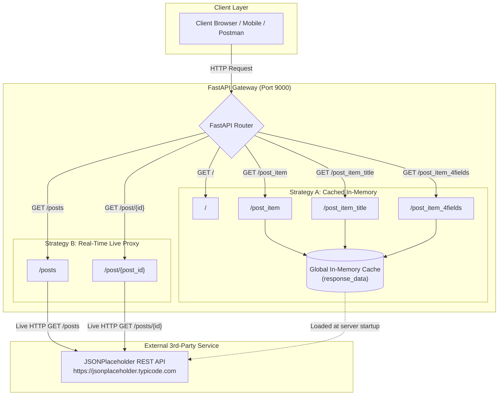

# FastAPI Third-Party API Integration 🌐

A clean, practical FastAPI project illustrating patterns for integrating, consuming, and serving external REST APIs. Using [{JSON} Placeholder](https://jsonplaceholder.typicode.com/) as the upstream data source, this repository compares two fundamental architectural integration strategies—**Startup-Time In-Memory Caching** versus **Real-Time Dynamic Proxying**—while demonstrating route parameterization, server orchestration, and integration testing with FastAPI's `TestClient`.

---

## 📋 Table of Contents

- [Overview](#-overview)
- [Architectural Patterns](#-architectural-patterns)
  - [Pattern 1: Startup In-Memory Cache](#pattern-1-startup-in-memory-cache)
  - [Pattern 2: Real-Time Dynamic Proxy](#pattern-2-real-time-dynamic-proxy)
- [Project Architecture & Data Flow](#-project-architecture--data-flow)
- [Repository Structure](#-repository-structure)
- [Prerequisites](#-prerequisites)
- [Installation & Setup](#-installation--setup)
- [Running the Application](#-running-the-application)
- [Interactive API Documentation](#-interactive-api-documentation)
- [API Reference](#-api-reference)
  - [Root Endpoint](#1-root-health-check)
  - [Cached / Static Endpoints](#2-cached-endpoints)
  - [Dynamic Live Endpoints](#3-dynamic-live-endpoints)
- [Testing](#-testing)
- [Production Considerations & Engineering Best Practices](#-production-considerations--engineering-best-practices)
  - [1. Async I/O: Migrating from `requests` to `httpx`](#1-async-io-migrating-from-requests-to-httpx)
  - [2. Robust Error & Timeout Handling](#2-robust-error--timeout-handling)
  - [3. Response Validation with Pydantic](#3-response-validation-with-pydantic)
- [Contributing & Feedback](#-contributing--feedback)

---

## 📖 Overview

Modern backend microservices frequently act as aggregators or gateways that consume upstream third-party services, reshape payloads, and expose sanitized contracts to frontends or client apps.

This project demonstrates how to:
- Establish HTTP communication between a FastAPI service and an external REST provider.
- Transform and slice incoming remote JSON payloads.
- Implement parameterized dynamic routes (`/post/{post_id}`) to fetch upstream resources on demand.
- Host the service using Uvicorn on custom network bindings (`0.0.0.0:9000`).
- Test endpoints reliably using `pytest` and `fastapi.testclient.TestClient`.

---

## 🏛 Architectural Patterns

The codebase highlights two distinct approaches to consuming external API data:

### Pattern 1: Startup In-Memory Cache
- **Implemented at:** Module initialization in [`main.py`](file:///C:/Users/rahim_ullah/Downloads/FastAPI/23-3rd-party-api/main.py)
- **Routes:** `/post_item`, `/post_item_title`, `/post_item_4fields`
- **Mechanism:** The application sends an HTTP GET request to JSONPlaceholder once when the Python module is first imported/loaded. The parsed JSON data is held in memory globally (`response_data`).
- **Trade-offs:**
  - ✅ **Zero Runtime Latency:** Client requests never wait on external network roundtrips.
  - ⚠️ **Data Staleness:** If the upstream database changes, the local app will serve stale data until restarted.
  - ⚠️ **Memory Footprint & Startup Delay:** Application startup depends entirely on external API availability and payload size.

### Pattern 2: Real-Time Dynamic Proxy
- **Implemented at:** Route handlers under `# A better way` in [`main.py`](file:///C:/Users/rahim_ullah/Downloads/FastAPI/23-3rd-party-api/main.py)
- **Routes:** `/posts`, `/post/{post_id}`
- **Mechanism:** Every incoming client request triggers a live HTTP request to the upstream service.
- **Trade-offs:**
  - ✅ **Real-Time Accuracy:** Always returns current upstream data.
  - ✅ **Resource Efficiency:** Fetches only the required record (e.g. `/posts/42`) rather than holding the entire collection in memory.
  - ⚠️ **External Latency Dependency:** Request durations are subject to upstream latency, network jitter, and external service downtime.

---

## 🔄 Project Architecture & Data Flow



---

## 📂 Repository Structure

```text
23-3rd-party-api/
├── main.py            # Primary application code: FastAPI instance, routes, and startup runner
├── main_test.py       # Integration tests using pytest and TestClient
├── requirements.txt   # Project dependencies and testing packages
├── README.md          # Project documentation, guides, and API contract
└── .venv/             # Python virtual environment (ignored in source control)
```

---

## ⚙️ Prerequisites

Before getting started, ensure you have the following installed on your machine:
- **Python 3.10+** (Python 3.12+ recommended)
- **pip** (Python package installer)
- Git (optional, for version control)

---

## 🚀 Installation & Setup

### 1. Clone or Navigate to the Project Directory
```powershell
cd C:\Users\rahim_ullah\Downloads\FastAPI\23-3rd-party-api
```

### 2. Create and Activate a Virtual Environment

**On Windows (PowerShell):**
```powershell
python -m venv .venv
.\.venv\Scripts\Activate.ps1
```

**On Windows (Command Prompt):**
```cmd
python -m venv .venv
.\.venv\Scripts\activate.bat
```

**On macOS / Linux:**
```bash
python3 -m venv .venv
source .venv/bin/activate
```

### 3. Install Dependencies
Install all required runtime and testing dependencies using `requirements.txt`:

```powershell
pip install -r requirements.txt
```

Alternatively, install the core packages directly:
```powershell
pip install fastapi uvicorn requests pytest httpx
```

*(Note: `httpx` is required by FastAPI's `TestClient`)*

---

## 💻 Running the Application

You can launch the server using either the built-in script runner or the Uvicorn command-line interface.

### Method A: Direct Execution (Configured in `main.py`)
Run the Python script directly. The script binds to `0.0.0.0` on port `9000`:
```powershell
python main.py
```

### Method B: Via Uvicorn CLI (With Auto-Reload)
For active development, run with the `--reload` flag:
```powershell
uvicorn main:app --host 0.0.0.0 --port 9000 --reload
```

Once running, the service will be accessible at:
- **Base URL:** `http://localhost:9000` or `http://127.0.0.1:9000`

---

## 📑 Interactive API Documentation

FastAPI automatically generates interactive, OpenAPI-compliant documentation for all registered endpoints:

- **Swagger UI:** [http://localhost:9000/docs](http://localhost:9000/docs)  
  *Explore, test, and inspect parameters directly from an intuitive browser interface.*
- **ReDoc:** [http://localhost:9000/redoc](http://localhost:9000/redoc)  
  *Clean, responsive, publication-ready API reference documentation.*

---

## 📡 API Reference

### 1. Root Health Check

#### `GET /`
Returns a simple JSON greeting confirming the service is active.

- **Request:**
  ```bash
  curl -X GET "http://localhost:9000/"
  ```
- **Response (200 OK):**
  ```json
  {
    "message": "Hello World!"
  }
  ```

---

### 2. Cached Endpoints
*These endpoints serve data from the in-memory array captured at startup time.*

#### `GET /post_item`
Retrieves a single item (index 5) from the cached dataset.

- **Request:**
  ```bash
  curl -X GET "http://localhost:9000/post_item"
  ```
- **Response (200 OK):**
  ```json
  {
    "message": {
      "userId": 1,
      "id": 6,
      "title": "dolorem eum magni eos aperiam quia",
      "body": "ut aspernatur corporis harum nihil quis provident sequi..."
    }
  }
  ```

#### `GET /post_item_title`
Extracts and returns only the `title` attribute of the first cached post (index 0).

- **Request:**
  ```bash
  curl -X GET "http://localhost:9000/post_item_title"
  ```
- **Response (200 OK):**
  ```json
  {
    "message": "sunt aut facere repellat provident occaecati excepturi optio reprehenderit"
  }
  ```

#### `GET /post_item_4fields`
Returns a sliced array containing the first 4 posts from the cached collection.

- **Request:**
  ```bash
  curl -X GET "http://localhost:9000/post_item_4fields"
  ```
- **Response (200 OK):**
  ```json
  {
    "message": [
      { "userId": 1, "id": 1, "title": "...", "body": "..." },
      { "userId": 1, "id": 2, "title": "...", "body": "..." },
      { "userId": 1, "id": 3, "title": "...", "body": "..." },
      { "userId": 1, "id": 4, "title": "...", "body": "..." }
    ]
  }
  ```

---

### 3. Dynamic Live Endpoints
*These endpoints forward calls dynamically to JSONPlaceholder at runtime.*

#### `GET /posts`
Fetches and returns the full list of posts from the upstream API.

- **Request:**
  ```bash
  curl -X GET "http://localhost:9000/posts"
  ```
- **Response (200 OK):**
  ```json
  [
    {
      "userId": 1,
      "id": 1,
      "title": "sunt aut facere repellat provident occaecati excepturi optio reprehenderit",
      "body": "quia et suscipit\nsuscipit recusandae consequuntur..."
    }
  ]
  ```

#### `GET /post/{post_id}`
Fetches a specific post by its identifier from the upstream provider.

- **Path Parameters:**
  | Parameter | Type | Required | Description |
  | :--- | :--- | :--- | :--- |
  | `post_id` | `integer` / `string` | **Yes** | Unique identifier of the post |

- **Request:**
  ```bash
  curl -X GET "http://localhost:9000/post/1"
  ```
- **Response (200 OK):**
  ```json
  {
    "userId": 1,
    "id": 1,
    "title": "sunt aut facere repellat provident occaecati excepturi optio reprehenderit",
    "body": "quia et suscipit\nsuscipit recusandae consequuntur expedita et cum..."
  }
  ```

- **Error Response (404 Not Found):**
  *(Returned if the requested `post_id` does not exist upstream)*
  ```json
  {
    "detail": "Post not found"
  }
  ```

---

## 🧪 Testing

The repository includes test suites managed via [`pytest`](https://docs.pytest.org/) and FastAPI's `TestClient`.

### Running Tests

Execute the test suite from your terminal:

```powershell
pytest -v
```

Or run directly through Python:
```powershell
python -m pytest -v main_test.py
```

### Test Suite Structure ([`main_test.py`](file:///C:/Users/rahim_ullah/Downloads/FastAPI/23-3rd-party-api/main_test.py))
```python
from fastapi.testclient import TestClient
from main import app

client = TestClient(app)

def test_root():
    response = client.get("/")
    assert response.status_code == 200
    assert response.json() == {"message": "Hello World!"}
```

> [!TIP]
> When testing live external endpoints like `/posts` or `/post/{post_id}` in production, prefer mocking HTTP requests (using libraries like [`pytest-mock`](https://pytest-mock.readthedocs.io/) or [`responses`](https://github.com/getsentry/responses)) to keep test runs fast, deterministic, and independent of external internet access.

---

## 🛡️ Production Considerations & Engineering Best Practices

While the current implementation demonstrates core principles effectively, production-grade microservices benefit from the following architectural enhancements:

### 1. Async I/O: Migrating from `requests` to `httpx`

> [!WARNING]
> In `main.py`, endpoints are defined as asynchronous (`async def`), yet they use `requests.get()`, which is **blocking synchronous I/O**. Inside an `async def` function, a blocking network call prevents FastAPI's single-threaded event loop from serving other concurrent requests while waiting for the upstream response.

**Recommended Solution:** Use [`httpx`](https://www.python-httpx.org/) with `httpx.AsyncClient`:

```python
import httpx
from fastapi import FastAPI, HTTPException

app = FastAPI()

@app.get("/posts")
async def get_posts():
    async with httpx.AsyncClient() as client:
        response = await client.get("https://jsonplaceholder.typicode.com/posts")
        return response.json()

@app.get("/post/{post_id}")
async def get_post_by_id(post_id: int):
    async with httpx.AsyncClient() as client:
        response = await client.get(f"https://jsonplaceholder.typicode.com/posts/{post_id}")
        if response.status_code == 404:
            raise HTTPException(status_code=404, detail=f"Post {post_id} not found")
        return response.json()
```

### 2. Robust Error & Timeout Handling
Upstream third-party services can time out, return `502 Bad Gateway`, or go offline. Protect your application using timeouts and structured exception handling:

```python
import httpx
from fastapi import HTTPException, status

@app.get("/post/{post_id}")
async def get_post_resilient(post_id: int):
    url = f"https://jsonplaceholder.typicode.com/posts/{post_id}"
    try:
        async with httpx.AsyncClient(timeout=5.0) as client:
            response = await client.get(url)
            response.raise_for_status()
            return response.json()
    except httpx.TimeoutException:
        raise HTTPException(
            status_code=status.HTTP_504_GATEWAY_TIMEOUT,
            detail="Upstream JSONPlaceholder service timed out."
        )
    except httpx.HTTPStatusError as exc:
        raise HTTPException(
            status_code=exc.response.status_code,
            detail=f"Upstream returned error: {exc.response.text}"
        )
```

### 3. Response Validation with Pydantic
Leverage Pydantic schemas to validate external payloads before serving them. This guarantees your API consumer receives a consistent, strongly typed contract:

```python
from pydantic import BaseModel

class PostSchema(BaseModel):
    userId: int
    id: int
    title: str
    body: str

@app.get("/post/{post_id}", response_model=PostSchema)
async def get_post(post_id: int):
    # Data will be validated against PostSchema automatically
    ...
```

---

## 🤝 Contributing & Feedback

Contributions, suggestions, and feature enhancements are welcome! Feel free to submit an issue or open a pull request.
