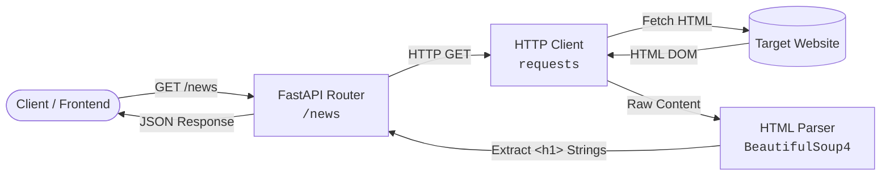

# FastAPI Web Crawler API

A minimalist, high-performance REST API service built with **FastAPI** and **BeautifulSoup4** for extracting and serving structured web data and news headlines in real time.

---

## Architecture & Flow



---

## Features

- **Blazing Fast Endpoint Delivery**: Powered by Starlette and Pydantic through FastAPI.
- **HTML DOM Parsing**: Extracts clean textual content from dynamic/static HTML structures using BeautifulSoup.
- **Auto-Generated Interactive Docs**: Out-of-the-box Swagger UI and ReDoc OpenAPI interfaces.
- **Configurable Target Scraping**: Ready-to-adapt selector logic for targeted site scraping.

---

## Tech Stack

| Component | Technology | Purpose |
| :--- | :--- | :--- |
| **Framework** | [FastAPI](https://fastapi.tiangolo.com/) | REST API routing and execution |
| **ASGI Server** | [Uvicorn](https://www.uvicorn.org/) | Lightning-fast ASGI web server |
| **HTTP Client** | [Requests](https://requests.readthedocs.io/) | Network requests to target pages |
| **DOM Parser** | [BeautifulSoup4](https://www.crummy.com/software/BeautifulSoup/) | HTML/XML parsing and tag extraction |

---

## Getting Started

### Prerequisites

- Python 3.10+
- `pip` package manager

### 1. Clone & Set Up Environment

```bash
# Navigate to project root
cd 24-webcrawling

# Create virtual environment
python -m venv .venv

# Activate virtual environment
# Windows (PowerShell):
.venv\Scripts\Activate.ps1
# Linux/macOS:
source .venv/bin/activate
```

### 2. Install Dependencies

```bash
pip install -r requirements.txt
```

### 3. Run the Service

You can run the server directly using Python:

```bash
python main.py
```

Or run via Uvicorn with hot-reload enabled:

```bash
uvicorn main:app --host 0.0.0.0 --port 8000 --reload
```

The service will be live at `http://localhost:8000`.

---

## API Reference

### 1. Health / Welcome Check

```http
GET /
```

#### Response (`200 OK`)
```json
{
  "message": "Welcome to the web crawler API!"
}
```

---

### 2. Scrape News Headlines

```http
GET /news
```

Fetches the target news source and extracts all primary headline titles (`<h1>` elements).

#### Response (`200 OK`)
```json
[
  "Headline 1 from target source",
  "Headline 2 from target source",
  "Headline 3 from target source"
]
```

---

### 3. Interactive Documentation

FastAPI automatically provisions interactive API exploration tools:

- **Swagger UI**: [http://localhost:8000/docs](http://localhost:8000/docs)
- **ReDoc UI**: [http://localhost:8000/redoc](http://localhost:8000/redoc)

---

## CLI & cURL Examples

```bash
# Test Root Endpoint
curl -X GET http://localhost:8000/

# Fetch Headlines
curl -X GET http://localhost:8000/news
```

Using PowerShell:
```powershell
Invoke-RestMethod -Uri "http://localhost:8000/news" -Method Get
```

---

## Project Structure

```text
24-webcrawling/
├── main.py              # FastAPI application, route handlers, crawler logic
├── requirements.txt     # Project dependency manifest
└── README.md            # Documentation
```

---

## Production Best Practices & Roadmap

To evolve this service into an enterprise-grade web scraping API, consider the following enhancements:

1. **Async Network I/O**: Replace synchronous `requests.get()` with `httpx.AsyncClient` to avoid blocking FastAPI's event loop during network calls.
2. **User-Agent Rotation & Headers**: Attach standard browser headers (e.g., `User-Agent`, `Accept-Language`) to prevent anti-scraping blocks (`403 Forbidden`).
3. **Resilience & Timeouts**: Add explicit network timeouts and retry logic (e.g., `tenacity` or `urllib3.util.Retry`).
4. **Dynamic Selectors**: Expose query parameters (`/scrape?url=...&selector=...`) with Pydantic validation to scrape arbitrary sources dynamically.
5. **Caching Layer**: Integrate Redis or `diskcache` with TTL to avoid repeatedly hammering target websites for identical payloads.
